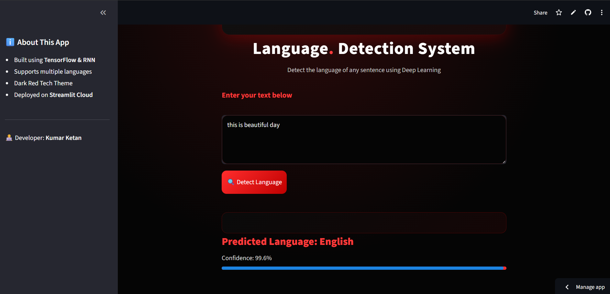
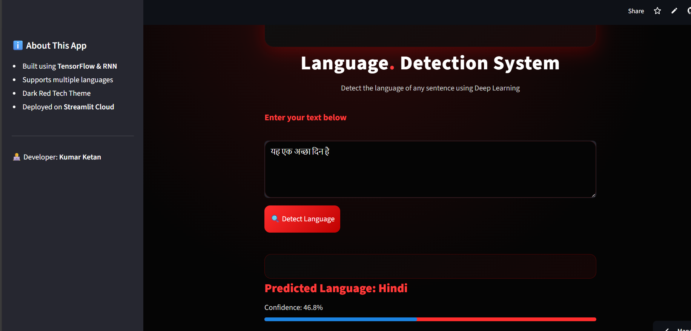

# 🌍 Language Detection System using RNN

  

A **Deep Learning–based Language Detection System** built using **TensorFlow and Recurrent Neural Networks (RNN)**.  
It predicts the language of a given sentence among multiple languages such as **English, Hindi, Kannada, French, Spanish, Tamil, Arabic**, etc.

The project demonstrates a complete **NLP pipeline** — from text preprocessing and tokenization to model training, evaluation, and real-time deployment using **Streamlit**.

---

## 📌 Project Highlights

- 🌐 Multi-class language classification  
- 🧠 RNN-based deep learning model  
- 🔤 Tokenization & padding  
- 🧹 Clean text preprocessing pipeline  
- 🚀 Streamlit web app deployment  
- 📊 Confidence score visualization  
- 🎨 Custom dark-red tech UI theme  

---

## 🧠 Model Architecture

**Architecture:**

Embedding Layer
→ SimpleRNN Layer
→ Dropout Layer
→ Dense (Softmax) Output Layer

**Flow:**

Raw Text → Cleaning → Tokenization → Padding
→ Embedding → RNN → Softmax → Predicted Language

---

## 🛠️ Tech Stack

| Category        | Tools / Libraries     |
|-----------------|-----------------------|
| Programming     | Python                |
| Deep Learning   | TensorFlow, Keras     |
| NLP             | Tokenizer, Padding   |
| Model Type      | SimpleRNN             |
| Frontend        | Streamlit             |
| UI Styling      | Custom CSS            |
| Deployment      | Streamlit Cloud       |

---

## 📂 Project Structure

Language_Detection_System/
│
├── saved_model/
│ └── simple_rnn_model.h5
│
├── datasets/
│ └── Language Detection.csv
│
├── tokenizer.pkl
├── eda.ipynb
├── prediction.ipynb
├── app.py
├── requirements.txt
└── readme.md

---

## ⚙️ How It Works

1. User enters a sentence in the web app  
2. Text is cleaned and preprocessed  
3. Sentence is tokenized and padded  
4. RNN model generates probability scores  
5. Final language is predicted  
6. Confidence score is displayed  

---

## 🖥️ Application Workflow

### 🔹 GitHub Repository

  

---

### 🔹 English Prediction

  

---

### 🔹 Hindi Prediction

  

---

### 🔹 Kannada Prediction

  

---

## 📊 Sample Predictions

| Input Text              | Predicted Language | Confidence |
|-------------------------|--------------------|------------|
| this is beautiful day   | English            | 99.6%      |
| यह एक अच्छा दिन है     | Hindi              | 46.8%      |
| ನೀವು ಹೇಗಿದ್ದೀರಿ?        | Kannada            | 93.5%      |

---
---  

🚀 Features
Supports multiple languages
Real-time predictions
Confidence bar visualization
Clean and modern UI
Sidebar app information panel  

🔮 Future Improvements
Replace SimpleRNN with BiLSTM / GRU
Improve performance on short texts
Add top-3 predictions display
Add more languages
Dockerize the application

---

## 👤 Author
**Kumar Ketan**  
Python |SQL| AI & ML|  

---

## ⭐ Acknowledgement
Thanks to open-source datasets and libraries that made this project possible.

---

## 🚀 Connect With Me
📧 Email: kketan6205@gmail.com  
🔗 LinkedIn: https://www.linkedin.com/in/kumar-ketan-5456b531b/  
 🐙 GitHub:  https://github.com/Kumar-Ketan  

---

⭐ Thanks for checking out this project!
